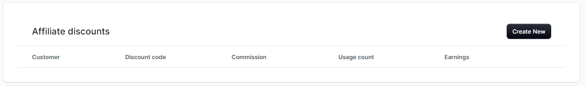
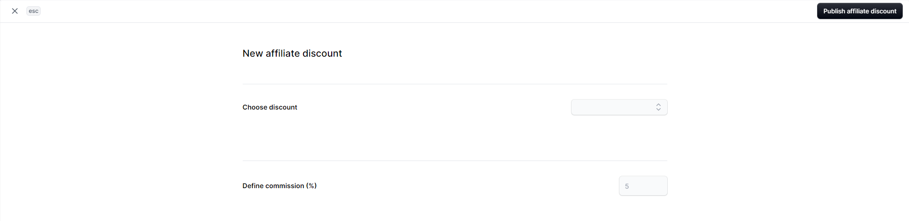
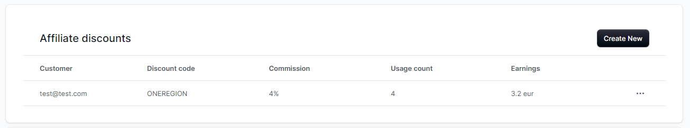

<p align="center">
  <picture>
    
  </picture>
</p>

<h1 align="center">
  Medusa Affiliate Discount
</h1>

Medusa "Affiliate Discount" is a plugin which enables possibility to create a discount which is a part of affiliation program.

### Why?

Affiliate marketing contains different activities. One of them is affiliation program, so a process which allows other entities (companies, people) to promote products in exchange for commission on each sale.
"Affiliate Discount" provides possibility to establish such cooperation and monitor usage count and earnings.

## Getting Started

1. Install the package with `yarn add @rsc-labs/medusa-affiliate-discount` or `npm i @rsc-labs/medusa-affiliate-discount`.
2. In `medusa-config.js`, add the plugin to the `plugins` array.

```js
const plugins = [
  // ... other plugins
  {
    resolve: `@rsc-labs/medusa-affiliate-discount`,
    options: {
      
    }
  }
]
```
1. If you are interested also in using simple Admin UI widget, please add `enableUI` option.
```js
const plugins = [
  // ... other plugins
  {
    resolve: `@rsc-labs/medusa-affiliate-discount`,
    options: {
      enableUI: true
    }
  }
]
```
## How can I use it?

### enableUI enabled

1. Create a new discount. 
   
   **Note:** Discount shall be assigned only to one region. See [Limitations](#Limitations) for more info.

2. Go to customer details page

    **Note:** Plugins assumes that you start your affiliate program with existing customer in your database.
   
3. On customer details page, you will find below UI widget. Click `Create new`




4. In below screen, choose a discount which you created and define commission in % (0-100).



5. Click `Publish affiliate discount`

### enableUI disabled

Follow above steps, but using API defined here:
[API](./src/api/README.md)

## How it works?

Your "affiliate" (customer to which you assigned a discount) can now share `Discount Code` to promote your products. When other customers will use provided discount code in their carts, then `usage count` and `earnings` are calculated for created `affiliate discount`.



### Details

`Usage count` and `earnings` are increased when event `Order.COMPLETED` is generated. 

**Note**: Remember that `Order.COMPLETED` is an event which you need to implement - it does not come by default from Medusa or it cannot be even generated from Admin UI.

You can change event on which these parameters are calculated - see [Configuration](#Configuration)

`Earnings` are calculated based on `commission` which you defined previously. The algorithm looks like this:

1. Take "items" from "order"
2. For every "item", take "unit_price", "quantity" and "adjustments".
3. Take every "adjustment" which contains "discountId", which is related to "affiliate_discount".
4. For every "adjustment" calculate `earnings` = `"unit_price"` * `"quantity"` * `commission`.
5. Add new `earnings` to existing ones.

### Configuration

You can change, when `earnings` and `usage count` are increased by providing `Order.PAYMENT_CAPTURED`.

```js
const plugins = [
  // ... other plugins
  {
    resolve: "medusa-affiliate-discount",
    options: {
      updateWhen: 'PAYMENT_CAPTURED',
      enableUI: true
    }
  }
]
```

**Note**: `Order.PAYMENT_CAPTURED` is the ONLY possible value here. If not set, `Order.COMPLETED` is taken by default. This assumption comes from the fact, that `earnings` calculation cannot be reverted, so any other event can be easily exploited by the customer.

**WARNING**: Please remember that plugin uses "eventName" to distinguish `Order.PAYMENT_CAPTURED` and `Order.COMPLETED`. It means to have it fully functional you need to have e.g. Redis Event Module - it won't work properly with Local Event Module. In such case calculation of `earnings` will be done twice (for `Order.PAYMENT_CAPTURED` and `Order.COMPLETED` - if you have `Order.COMPLETED` implemented), so please be careful!

### Limitations

As this is just the beginning, here are current limitations:

1. `Earnings` is simple calculation, but to keep it simple, we need to assume that there is only one currency. In case of international buyings, calculation of `earnings` won't be trivial. One currency is guaranteed by having a discount related to one region which can have only one currency.
2. For simplicity - affiliate discount cannot be edited. It means that if you want to reset earnings (e.g. when you pay your customer), then you need to delete affiliate discount and create new one. For some scenarios it can be even a better choice, for instance when your discount expired and you would like to create new one.
3. Admin UI widget is very simple - it might not cover all corner case in terms of validation of fields. One of the reason is that we still do not have experience in HTML/CSS. The other reason is that we are using basic stuff from `@medusajs/ui`, which is heavily limited. If `@medusajs/ui` will be improved, then improvements could be ported here.
4. The only commission type which is now supported is "percentage". If there will be interest about this plugin, then it might be improved.

## TODO

[] Tests

[] Limit limitations :)

[] Develop full affiliate marketing - in case of interest, please contact.

## Contribution

Contributions are welcome and they are greatly appreciated!

## License

MIT

---

© 2024 RSC https://rsoftcon.com/
